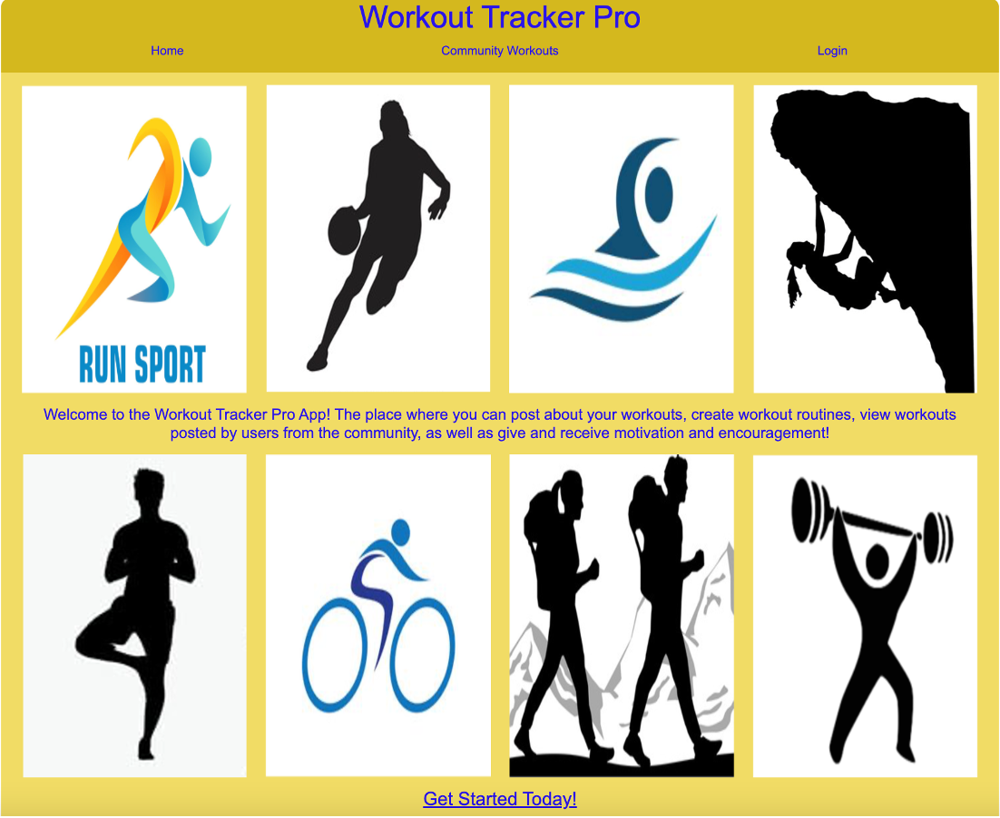
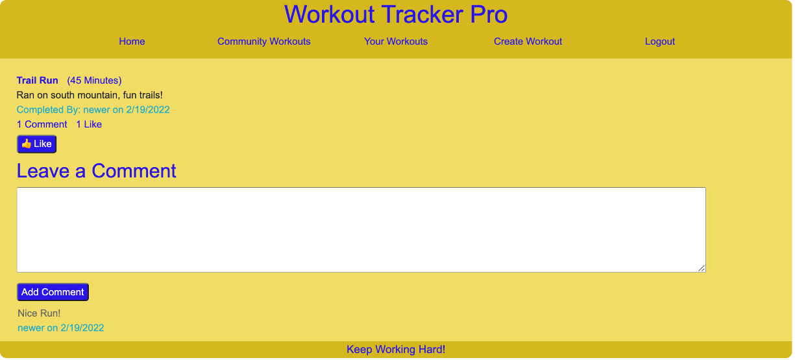
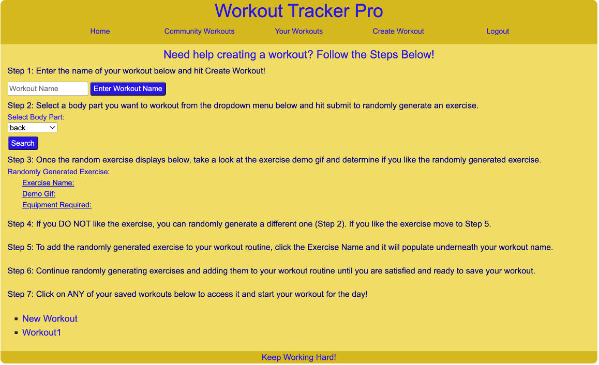

# Workout Tracker Pro

# Description

The Workout Tracker Pro app was created to provide users with a motivating and encouraging way to combine fitness and social media. Workout Tracker Pro allows its users to post about workouts, create workouts, view other users workouts, and comment and like other users workouts. This app was designed to make fitness fun and encourage more people to get active and share their experiences with fitness.  

# Table of Contents
- [Built With](#built-with)
- [Code Access](#code-access)
- [Preview](#preview)
- [Functionality](#functionality)
- [License](#license)
- [Workout Tracker Pro Link](#workout-tracker-pro-link)
- [Questions](#questions)
- [Credit / Contribution](#credit--contribution)

# Built With
- Handlebars
- Bootstrap
- CSS 
- Javascript
- Node.js
- Express.js
- Express-Session
- Bcrypt
- Connect-Session-Sequelize
- MySQL
- Sequelize
- SweetAlert
- Axios
- ExerciseDB API

# Code Access

If you would like to access the code for this project, please visit this [GitHub](https://github.com/sm3131/workout-tracker-pro) repository. 

# Preview

Below are screenshots of the Workout Tracker Pro application:

# Functionality

Provided below is an overview of how the Workout Tracker Pro application functions as well as some of the features it offers:
- Upon visiting the app, the user will be presented with the homepage which describes what the app offers and how to get started.
- As a visitor without an account you have the ability to view users' workouts, but you cannot interact with these posts until you create an account.
- In order to sign up the user will visit the Login link, and create an account if they are new or login if they have already created an account.
- Once logged in the user will be redirected to their profile page, which contains all of their workout posts if they have any as well as a form to create a new workout post.
- The logged in user can now also visit the Community Workouts page and start interacting with other users posts. When clicking on a post you are brought to a page with that individual workout where you can now leave a like or comment on the workout. 
- As a logged in user, you can also create a workout. If the user visits the Create Workout page, they will be presented with a step by step walk through of how to create an individualized workout routine. 
- Briefly, in order to create a workout the user will start by entering in a routine name, then they will use the random exercise generator to start generating exercises based on body part, once an exercise is generated the user can view the exercise demo gif and decide if they want to add it to their workout or generate a new exercise, once the user has added numerous exercises to their routine they can then save the workout and it will now show up at the bottom of the page for them to refer back to whenever they choose. 
- Once finished on the site the user can choose to either stay logged in until their session ends or logout using the logout button in the navigation bar.

# License

MIT License

Copyright (c) 2022 Sammi Moore

Permission is hereby granted, free of charge, to any person obtaining a copy of this software and associated documentation files (the "Software"), to deal in the Software without restriction, including without limitation the rights to use, copy, modify, merge, publish, distribute, sublicense, and/or sell copies of the Software, and to permit persons to whom the Software is furnished to do so, subject to the following conditions:

The above copyright notice and this permission notice shall be included in all copies or substantial portions of the Software.

THE SOFTWARE IS PROVIDED "AS IS", WITHOUT WARRANTY OF ANY KIND, EXPRESS OR IMPLIED, INCLUDING BUT NOT LIMITED TO THE WARRANTIES OF MERCHANTABILITY, FITNESS FOR A PARTICULAR PURPOSE AND NONINFRINGEMENT. IN NO EVENT SHALL THE AUTHORS OR COPYRIGHT HOLDERS BE LIABLE FOR ANY CLAIM, DAMAGES OR OTHER LIABILITY, WHETHER IN AN ACTION OF CONTRACT, TORT OR OTHERWISE, ARISING FROM, OUT OF OR IN CONNECTION WITH THE SOFTWARE OR THE USE OR OTHER DEALINGS IN THE SOFTWARE.

# Workout Tracker Pro Link

The link to the deployed Workout Tracker Pro app is provided below:

# Questions

If you would like to access this project's repository as well as other projects in the creators' GitHubs, click on any of the links provided below:

[Sammi Moore GitHub](https://github.com/sm3131)

[Michael Bair GitHub](https://github.com/mbair87)

[Bianca Tijerino GitHub](https://github.com/btijerino16)

For all other questions or inquires please feel free to contact any of the creators via email at:

[sm2683@nau.edu](mailto:sm2683@nau.edu)

[mbair87@gmail.com](mailto:mbair87@gmail.com)

[btijerino16@hotmail.com](mailto:btijerino16@hotmail.com)

# Credit / Contribution

The Workout Tracker Pro app was created by Sammi Moore, Michael Bair, and Bianca Tijerino.

The breakdown of tasks is as follows:

Sammi Moore: API routes, handlebars, front-end javascript, Bootstrap, third party API inclusion, database models, and other HTTP routes (front and back end)

Michael Bair: Handlebars, database models, front-end javascript, third party API (front and back end)

Bianca Tijerino: Handlebars and CSS (front-end)

The resources used for this project are as follows:
- ExerciseDB third party API (https://rapidapi.com/justin-WFnsXH_t6/api/exercisedb)
- Axios Promise based HTTP client for the browser and node.js (https://www.npmjs.com/package/axios)
- SweetAlert CDN to create tasteful alert modals(https://sweetalert.js.org/guides/)
- Bootstrap for styling (https://getbootstrap.com/docs/5.1/getting-started/introduction/)
-  The Bcrypt package to hash and validate passwords (https://www.npmjs.com/package/bcrypt)
- The connect-session-sequelize package from npm to create a session in node.js (https://www.npmjs.com/package/connect-session-sequelize)
- The Express-session package from npm to create a session in node.js (https://www.npmjs.com/package/express-session)
- The sequelize package from npm in this node.js application in order more easily use mysql databases (https://www.npmjs.com/package/sequelize)
- The mysql2 package from npm to create and store the database and data (https://www.npmjs.com/package/mysql2)
- The express package from npm to create the server and routes (https://www.npmjs.com/package/express)
- The express-handlebars package from npm to create the front-end of the app (https://www.npmjs.com/package/express-handlebars)
- The dotenv package from npm to to hide mysql passwords and usernames when pushing code to GitHub (https://www.npmjs.com/package/dotenv)
- https://opensource.org/licenses/ (To borrow the license section text describing the terms of each of the licenses included in the readme generator)
- https://shields.io/ (To generate the link to create the license badge)
For the license badges and license section of the readme, I used the following resources:
- https://choosealicense.com/ (To help with picking which licenses to include)
- https://shields.io/ (To generate the link to create the license badge)
- https://wisehackermonkey.github.io/badge-demo/ (To help with coloring the license badges and grabbing the license links)
- https://opensource.org/licenses/ (To borrow the license section text describing the terms of each of the licenses included in the readme)
- Documentation and material from the lessons in modules 13 and 14 to aid in proper set up of servers, db connections, models, controllers, views, etc. 